# Android Endpoints "Todo.txt" CodeLab

*Updated July 2014*

This codelab is an introduction to **Google Cloud Endpoints**, the technology
that enables the publication of RESTful APIs which can easily be consumed by
Android applications.

We will start from an **existing mobile Android application** and connect it
to a brand **new backend powered by Cloud Endpoints**. All development are done
with the Android Studio IDE.

The original github repository for this codelab is here:
[https://github.com/GoogleCloudPlatform/endpoints-codelab-android/](https://github.com/GoogleCloudPlatform/endpoints-codelab-android/)

##Table of Contents

- [Android Endpoints "Todo.txt" CodeLab](#user-content-android-endpoints-todotxt-codelab)
    - [Codelab Requirements](#user-content-codelab-requirements)
    - [Introduction](#user-content-introduction)
        - [The Todo.txt application](#user-content-the-todotxt-application)
        - [Android Studio - the integrated tool](#user-content-android-studio---the-integrated-tool)
        - [Google Cloud Endpoints - where the magic happens](#user-content-google-cloud-endpoints---where-the-magic-happens)
        - [Overall codelab architecture](#user-content-overall-codelab-architecture)
    - [Step 0 - Create your own project in the Google Developers Console](#user-content-step-0---create-your-own-project-in-the-google-developers-console)
    - [Step 1 - Get the Android application source code](#user-content-step-1---get-the-android-application-source-code)
    - [Step 2 - Create the Endpoints backend project](#user-content-step-2---create-the-endpoints-backend-project)
    - [Step 3 - Implement reading and writing tasks to the Datastore](#user-content-step-3---implement-reading-and-writing-tasks-to-the-datastore)
    - [Step 4 - Modify the android application to use the new backend. Run. Test.](#user-content-step-4---modify-the-android-application-to-use-the-new-backend-run-test)
    - [Step 5 - Escape to the command line and deploy to production!](#user-content-step-5-escape-to-the-command-line-and-deploy-to-production)
    - [Step 6 - Improve the application!](#user-content-step-6-improve-the-application)
    - [Appendix - Using the APIs Explorer](#user-content-appendix---using-the-apis-explorer)
    - [Appendix - Looking around the App Engine Console](#user-content-appendix---looking-around-the-app-engine-console)

## Codelab Requirements

* A reasonably-powered laptop with plenty of RAM
    * please avoid ultrabooks! sorry, also no chromebooks ATM
* A Java Development Kit (**JDK, not JRE**), version 7 (Java 7)
* Latest **[Android Studio](http://developer.android.com/sdk/installing/studio.html#download)** (tested with [0.8.4](http://tools.android.com/download/studio/canary))
    * **The Android Emulator**
        * The AVD should be created with:
            * Android 4.4.x API Level 19+
            * Hardware Keyboard Present
            * SD Card present, 200MiB
    * **Android SDK Manager** (accessible from Tools > Android) configured with:
        * Android SDK Tools (tested with 23.0.2)
        * Android SDK Platform-tools (tested with 20)
        * Android SDK Build-tools 19.1
        * Android Support Repository (tested with 6)
        * Android 4.0.3 (API 15+) or above **including "Google APIs"**

## Introduction

### The Todo.txt application


Todo.txt is an Android application [available from the Play Store](https://play.google.com/store/apps/details?id=com.todotxt.todotxttouch)
that stores tasks in the Cloud. It's simple to understand and use, has great
user ratings and, best of all, is open sourced with full code available on
GitHub at [https://github.com/ginatrapani/todo.txt-android](https://github.com/ginatrapani/todo.txt-android).

In this codelab we will use a single development environment (Android Studio)
to build a brand new Google Cloud Platform backend to store user tasks, thus
replacing the application's existing Cloud provider.


All coding in this codelab, client and backend, will be done in Java within
Google App Engine's free tier and using
[Google Cloud Endpoints](https://developers.google.com/appengine/docs/java/endpoints/).

### Android Studio - the integrated tool

Please read this [short intro to Android Studio](docs/AndroidStudio.md), the
IDE used throughout the codelab.


### Google Cloud Endpoints - where the magic happens

Please read this [brief intro to Google Cloud Endpoints](docs/CloudEndpoints.md),
the key underlying technology for this codelab.

### Google Cloud Datastore - because scaling your data matters

[Google Cloud DataStore](https://developers.google.com/datastore/)
is another key technology used in this codelab and used for storing user data
generated in the Android application once they've made it to your cloud
application via the [Endpoints technology](./CloudEndpoints.md). This Datastore
is a fully-managed data storage service, no need to start, stop, patch or
administer this highly-scalable NoSQL database - it is provided to you the
developer as a service.

### Overall codelab architecture

As you can see on this diagram, we'll be building an
[App Engine](https://developers.google.com/appengine) application which will
store the user tasks in Google's
[Cloud Datastore](https://developers.google.com/datastore/) and communicate
with the Android application via Endpoints.


Using this new backend will require making small changes to the current
Android application.

To make to calls to our RESTful endpoints, we can rely on generated client
libraries which will help us make calls from the Android application as if
they we local. No JSON parsing or HTTP-level coding required!

Let's get going!


## Step 0 - Create your own project in the Google Developers Console

Point your browser to the
[developers console](https://console.developers.google.com/) and create a new
project (login first if required):

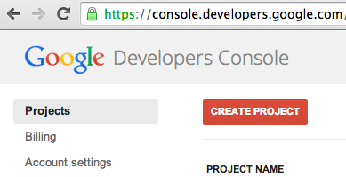   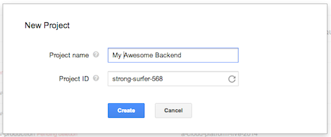

Use the suggested **Project ID** (it is unique and available) or create your
own. You'll need this to deploy your backend after it's created using Android
Studio so remember what you enter.

Once created, this Google Cloud Platform project will enable you to manage all
the services the Cloud Platform has to offer. In this lab, we'll use App Engine
and Cloud Datastore.

Every Google Cloud Platform project can create a free and private
**git repository** which you're free to use in this lab but this is not a
requirement. You can also connect your project to an existing GitHub repo.
Both these options can be used with
[Push-to-Deploy](https://developers.google.com/appengine/docs/push-to-deploy)
feature and are available from the console's "Source Code > Releases" section.

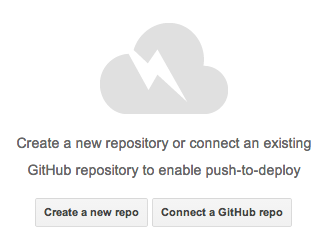

In this codelab we'll start a new backend project from scratch.


## Step 1 - Get the Android application source code

The Android application source code is available in
[this GitHub repository](https://github.com/GoogleCloudPlatform/endpoints-codelab-android)
as a Gradle project You can get the source code on your machine by running the
following command:

```git clone https://github.com/GoogleCloudPlatform/endpoints-codelab-android```

Alternatively, you can download this [.zip archive]
(https://github.com/GoogleCloudPlatform/endpoints-codelab-android/archive/master.zip). This is the slightly
modified version of the [Todo.txt application code found on GitHub](https://github.com/ginatrapani/todo.txt-android),
enough to start coding to add Google Cloud Platform as a backend.

Open Android Studio and import the code as a new project.

> Remember, this needs to use **Java 7**. Check the SDK Location in your
**File** > **Project Structure**.

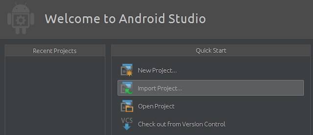

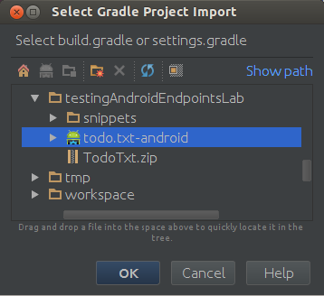

This should trigger a successful (Gradle) build:
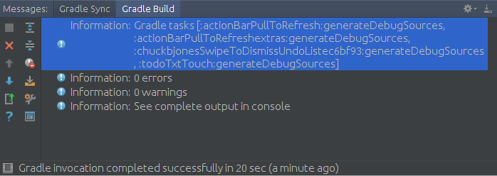

> * If the build fails, make sure you have the **Support Repository** installed
(see last paragraph of [http://developer.android.com/sdk/installing/studio.html](http://developer.android.com/sdk/installing/studio.html)
for details).
> * If you are asked to setup an Android SDK ("Project SDK is not defined"),
simply click on the "Setup SDK" link and select the SDK without configuring it.
Avoid for now anything above API level 19 (the Android "L preview release" is
not fully baked yet).

From here we'll create, build and test the backend before we make our way
back to the Android client to hook it up to this new backend.


## Step 2 - Create the Endpoints backend project

Android Studio has built-in support for Google Cloud Endpoints (as part of the
IDE's support for [App Engine backend templates](https://github.com/GoogleCloudPlatform/gradle-appengine-templates))

To add a backend to the current Android project, simply go to:
**File > New Module** or right-click on your "endpoints-codelab-project" in the
Project side pane and choose **New > Module**.

> You could also achieve the same thing by adding a new module to the project
(File > New Module > App Engine Java Endpoints Module)

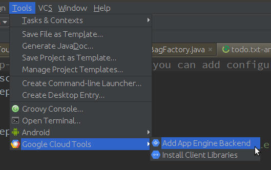

**IMPORTANT**: Make sure you select the "App Engine Java **Endpoints** Module"
template and enter the following values in the next screen:

* Module Name: **todoTxtBackend**
* Package Name: **com.google.todotxt.backend**
* Client module: **todoTxtTouch (com.todotxt.todotxttouch)**

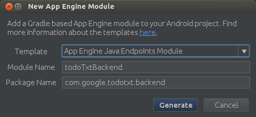

This creates a new backend Gradle module for our Android Studio project
(using the [Gradle App Engine
  Plugin](https://github.com/GoogleCloudPlatform/gradle-appengine-plugin))
and adds it as an additional dependency in the `settings.gradle` file. It
also adds the required dependencies for the generated client libraries to the
app's `build.gradle` file. The generated code is pretty straight-forward with
an object model for the data manipulated by the Endpoint and the actual
Endpoint implementation:

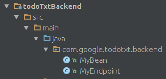

```java
@Api(name = "myApi", version = "v1",
     namespace = @ApiNamespace(ownerDomain = "backend.todotxt.google.com",
                                 ownerName = "backend.todotxt.google.com",
                               packagePath = ""))
public class MyEndpoint {
    @ApiMethod(name = "sayHi")
    public MyBean sayHi(@Named("name") String name) {
        MyBean response = new MyBean();
        response.setData("Hi, " + name);
        return response;
    }
}
```

An HTTP POST request to `myApi/v1/sayHi/Test` will be routed to the `sayHi()`
method and `"Test"` will be mapped to the `name` attribute.

The convention here is that sending data to the Endpoint implies that the
server state will change and thus only POST requests will be mapped to this
method. You can be explicit about which HTTP verb is used (in particular to
distinguishing between a PUT and a POST) by specifying the optional
`httpMethod` attribute of `@ApiMethod` (`HttpMethod.POST` in this case).

> * All Cloud Endpoints annotations and attributes are documented here:
[https://developers.google.com/appengine/docs/java/endpoints/annotations](https://developers.google.com/appengine/docs/java/endpoints/annotations)
> * Parameter types and return values are documented here: [https://developers.google.com/appengine/docs/java/endpoints/paramreturn_types](https://developers.google.com/appengine/docs/java/endpoints/paramreturn_types)

Without making any changes for the time being, simply start the development
app server (a full App Engine local environment) by pressing the green
"Play" button after selecting **todoTxtBackend** as the current module:

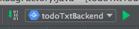  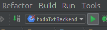

> If you see a red cross on the module, this means that either:
> * you do not have a Java 7 setting for the project. You'll need to update
this in:
> **File > Project Structure > SDK Location > JDK location**.
> * you have to build the module first to bring in all the dependencies
(such as the App Engine SDK). Simply **Build > Make module 'todoTxtBackend'**.

Once the development app server has started you should see this log message:

```
INFO: Module instance default is running at http://localhost:8080/
com.google.appengine.tools.development.AbstractModule startup
INFO: The admin console is running at http://localhost:8080/_ah/admin
com.google.appengine.tools.development.DevAppServerImpl doStart
INFO: Dev App Server is now running
```

You can then point your browser to [http://localhost:8080](http://localhost:8080)
to exercise the sample Endpoints functionality or more interestingly go to
[http://localhost:8080/_ah/api/explorer](http://localhost:8080/_ah/api/explorer)
to use the Google API Explorer tool which you may already be familiar with if
you've used in the past any public Google API. See the
[Appendix - Using the APIs Explorer](#user-content-appendix---using-the-apis-explorer)
at the end of this document for further details.

Once done testing the default Endpoint, stop the local development app server
(use the red square in the log window or **Run > Stop**).

At this point we have the basic Endpoints infrastructure in place but we still
need to store tasks in a persistent Datastore and wire up the Android
application to use this new backend.

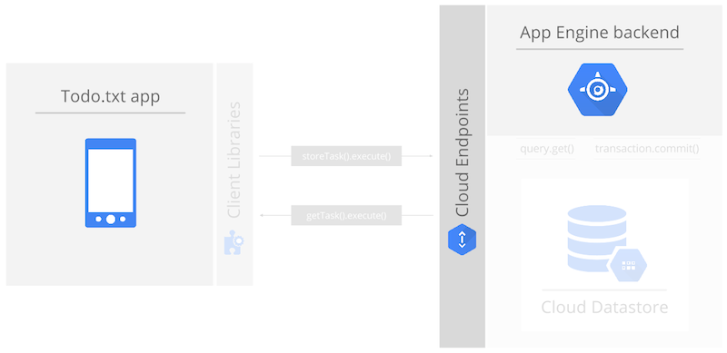


## Step 3 - Implement reading and writing tasks to the Datastore

Let's start with some small refactoring:

1. Rename the `MyBean` class to `TaskBean` (**Refactor > Rename**)
2. Add a `Long id` attribute to the `TaskBean` class along with getter and
setter (**Code > Generate > Getter and Setter**)

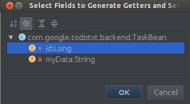

This is the modified **TaskBean** class:

```java
public class TaskBean {
    private Long id;
    public Long getId() { return id; }
    public void setId(Long id) { this.id = id; }

    private String myData;
    public String getData() { return myData; }
    public void setData(String data) { myData = data; }
}
```

In `MyEndpoint.java`, change the name of the Endpoint from `"myApi"` to
`"TaskApi"`. Notice how a tooltip indicates that this is not a recommended
name (names should not be capitalized). Consequently, change it to `"taskApi"`:

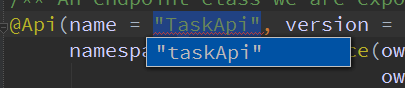

This suggestion is one of a set of Endpoints-related inspections in Android
Studio which you can find in the project properties:

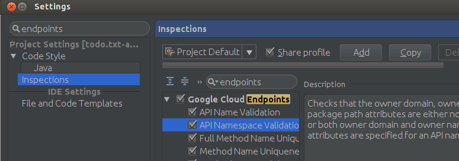

Remove the default `sayHi()` method and add these three methods and associated
annotations (you can either copy/paste from this document or use the
`MyEndpoint.java` file located in the
[`snippets/` directory](./snippets/MyEndpoint.java) of the archive for this
codelab):

The following `storeTask` method will be invoked when the following HTTP
request is received:
`POST https://<project_id>.appspot.com/_ah/api/taskApi/v1/storeTask`

Note how the `@Api` and `@ApiMethod` attributes are used to build this URI.
The mapping from a POST request is implicit again here because we're passing
the method a parameter (of type `TaskBean`). This parameter is exchanged on
the wire in json format (as a simple pair of `data` and `id` attribute values)
and marshalled in and out of Java directly by Cloud Endpoints.

```java
@ApiMethod(name = "storeTask")
public void storeTask(TaskBean taskBean) {
    DatastoreService datastoreService = DatastoreServiceFactory.getDatastoreService();
    Transaction txn = datastoreService.beginTransaction();
    try {
        Key taskBeanParentKey = KeyFactory.createKey("TaskBeanParent", "todo.txt");
        Entity taskEntity = new Entity("TaskBean", taskBean.getId(), taskBeanParentKey);
        taskEntity.setProperty("data", taskBean.getData());
        datastoreService.put(taskEntity);
        txn.commit();
    } finally {
        if (txn.isActive()) {
            txn.rollback();
        }
    }
}
```

This next `getTasks()` method is invoked when this HTTP request is received:

`GET https://<project_id>.appspot.com/_ah/api/taskApi/v1/taskbeancollection`

This time we're responding to a GET operation because the method takes no
parameter and starts with `get` and thus it should be safe to assume that all
such request will be idempotent (i.e. it will not change the server state).

```java
@ApiMethod(name = "getTasks")
public List<TaskBean> getTasks() {
    DatastoreService datastoreService = DatastoreServiceFactory.getDatastoreService();
    Key taskBeanParentKey = KeyFactory.createKey("TaskBeanParent", "todo.txt");
    Query query = new Query(taskBeanParentKey);
    List<Entity> results = datastoreService.prepare(query).asList(FetchOptions.Builder.withDefaults());

    ArrayList<TaskBean> taskBeans = new ArrayList<TaskBean>();
    for (Entity result : results) {
        TaskBean taskBean = new TaskBean();
        taskBean.setId(result.getKey().getId());
        taskBean.setData((String) result.getProperty("data"));
        taskBeans.add(taskBean);
    }

    return taskBeans;
}
```

This third and final `clearTasks()` method is called on this HTTP request:

`POST https://<project_id>.appspot.com/_ah/api/taskApi/v1/clearTasks`

```java
@ApiMethod(name = "clearTasks")
public void clearTasks() {
    DatastoreService datastoreService = DatastoreServiceFactory.getDatastoreService();
    Transaction txn = datastoreService.beginTransaction();
    try {
        Key taskBeanParentKey = KeyFactory.createKey("TaskBeanParent", "todo.txt");
        Query query = new Query(taskBeanParentKey);
        List<Entity> results = datastoreService.prepare(query)
            .asList(FetchOptions.Builder.withDefaults());
        for (Entity result : results) {
            datastoreService.delete(result.getKey());
        }
        txn.commit();
    } finally {
        if (txn.isActive()) { txn.rollback(); }
    }
}
```

This method clearly does modify the server state and thus its name does not
start with `get`. An HTTP POST is required to call this method. Another
common RESTful request is the use of HTTP PUT but in our case we're never
modifying existing data. If needed, here are the appropriate import statements
for the entire endpoints class:

```java
import com.google.api.server.spi.config.Api;
import com.google.api.server.spi.config.ApiMethod;
import com.google.api.server.spi.config.ApiNamespace;
import com.google.appengine.api.datastore.DatastoreService;
import com.google.appengine.api.datastore.DatastoreServiceFactory;
import com.google.appengine.api.datastore.Entity;
import com.google.appengine.api.datastore.FetchOptions;
import com.google.appengine.api.datastore.Key;
import com.google.appengine.api.datastore.KeyFactory;
import com.google.appengine.api.datastore.Query;
import com.google.appengine.api.datastore.Transaction;

import java.util.ArrayList;
import java.util.List;
```

These three methods all manipulate instances of `TaskBean` to store, read
and delete tasks from the Datastore. Getting a hold of the Datastore is as
easy as calling a factory method. `TaskBean` instances need to be turned
into Entity instances with a hard-coded `"todo.txt"` key and appropriate
attributes before they can be read from or wrote into the Cloud Datastore.
Writing and deleting happens within the boundaries of a transaction.

At this point we have a **fully functional backend** exposing three methods to
store, read and delete tasks in the highly-scalable Cloud Datastore, all
through the Cloud Endpoints technology.

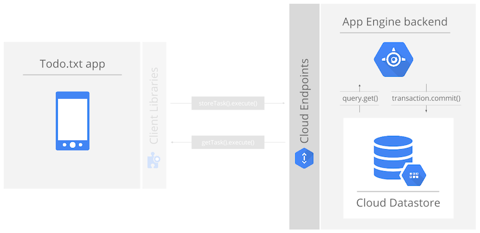

## Step 4 - Modify the Android application to use the new backend. Run. Test.

While exposing standard RESTful interfaces makes it possible to access them
from an Android application, the Cloud Endpoints technology is able to create
client libraries (in our case a Java library) to enable a much easier
implementation on the client-side with high-level abstractions such as Java
classes rather than the underlying JSON and HTTP concepts.

To generate these client libraries, we can simply re-build the backend by
navigating to **Build > Make Module 'todoTxtBackend'**. Once the build
finishes, the generated client libraries will be placed in
`todoTxtBackend/build/libs/todoTxtBackend-endpoints-android.jar` archive.

To start calling these libraries, let's add the following compile dependency
to the Android client in `todoTxtTouch/build.gradle` file (if it's not already
present):

```groovy
dependencies {
  ...
  compile fileTree(dir: 'libs', include: ['*.jar'])
}
```

If required, the complete `build.gradle` file for `todoTxtTouch` is located in
the [`snippets/` directory](./snippets/build.gradle) of the codelab archive.

Once you've made this change, you'll be prompted to perform a **"Gradle sync"**:


When the Gradle sync finishes, your Android client application is ready to start
using the Endpoints client library to store tasks in our Google Cloud backend.

Here's how we can do it. First, navigate to the
`com/todotxt/todotxttouch/task/TaskBagImpl.java` file in the `todoTxtTouch`
module (it may be one of the tabs already open) and navigate to line 215
(using **Navigate > Line** should get you to `/* REMOTE APIS */`).

This is the interesting part: the `pushToRemote` and `pullToRemote` methods
implement the actual communication with the backend which we want to set to
use the Google Cloud Platform. Rather than making changes to this existing
class we'll create a new subclass of `TaskBagImpl` called `EndpointsTaskBagImpl`
(full source [here](./snippets/EndpointsTaskBagImpl.java)):

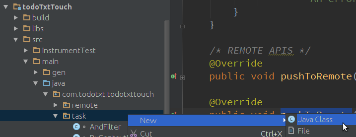

```java
package com.todotxt.todotxttouch.task;

public class EndpointsTaskBagImpl extends TaskBagImpl {
    final TaskApi taskApiService;

    // Constructor
    public EndpointsTaskBagImpl (TodoPreferences preferences, LocalTaskRepository localRepository) {
        super(preferences, localRepository, null);
        TaskApi.Builder builder = new TaskApi.Builder(AndroidHttp.newCompatibleTransport(),
            new AndroidJsonFactory(), null)
                .setRootUrl("http://10.0.2.2:8080/_ah/api/")
                .setGoogleClientRequestInitializer( new GoogleClientRequestInitializer() {
                    @Override
                    public void initialize(AbstractGoogleClientRequest<?> abstractGoogleClientRequest)
                            throws IOException {
                        abstractGoogleClientRequest.setDisableGZipContent(true);
                    }
                }

            );
        taskApiService = builder.build();
    } // end of constructor, other methods to follow in this class...
```

This constructor above sets up a development environment by initializing the
`TaskApi` instance to enable testing with the local development app server and
the local Android emulator. As we'll see later, the initialization for the
production code is somewhat simpler.

> If you were to run it on a real device, here are the required changes:
>
> 1. edit the `todoTxtBackend` run configuration to listen on 0.0.0.0 (default is 127.0.0.1)
>
> 2. replace 10.0.2.2 with the LAN ip address of the laptop

The other two methods for the class are the new overridden `pushToRemote` and
`pullFromRemote` methods. These methods use the `taskApiService` and instances
of `TaskBean` which are synchronized with the local application task repository.
Here is the first method (you do not need to type this one) pushing local tasks
to our Google Cloud backend via a simple call to
`taskApiService.storeTask(taskBean).execute()`.

```java
@Override
public synchronized void pushToRemote (boolean overridePreference, boolean overwrite) {
    try {
        ArrayList<String> taskStrList =
            TaskIo.loadTasksStrFromFile(LocalFileTaskRepository.TODO_TXT_FILE);
        taskApiService.clearTasks().execute();

        long id = 1;
        for (String taskStr : taskStrList) {
            TaskBean taskBean = new TaskBean();
            taskBean.setData(taskStr);
            taskBean.setId(id++);
            taskApiService.storeTask(taskBean).execute();
        }

        lastSync = new Date();

        } catch (IOException e) {
            Log.e(EndpointsTaskBagImpl.class.getSimpleName(),
            "Error when storing tasks", e);
    }
}
```

Finally, the second method reads all the tasks stored in our Google Cloud
backend via a call to `taskApiService.getTasks().execute().getItems()` and
writes them to local storage.

```java
@Override
public synchronized void pullFromRemote(boolean overridePreference) {

   try {
      // Remote Call
      List<TaskBean> remoteTasks = taskApiService.getTasks().execute().getItems();

      if (remoteTasks != null) {
          ArrayList<Task> taskList = new ArrayList<Task>();
          for (TaskBean taskBean : remoteTasks) {
              taskList.add(new Task(taskBean.getId(), taskBean.getData()));
          }
          store(taskList);
          reload();
          lastSync = new Date();
       }
    } catch (IOException e) {
        Log.e(EndpointsTaskBagImpl.class.getSimpleName(), "Error when loading tasks", e);
    }
}
```

Here is the full list of import statements for `EndpointsTaskBagImpl`:

```java
import android.util.Log;

import com.google.api.client.extensions.android.http.AndroidHttp;
import com.google.api.client.extensions.android.json.AndroidJsonFactory;
import com.google.api.client.googleapis.services.AbstractGoogleClientRequest;
import com.google.api.client.googleapis.services.GoogleClientRequestInitializer;
import com.google.todotxt.backend.taskApi.TaskApi;
import com.google.todotxt.backend.taskApi.model.TaskBean;
import com.todotxt.todotxttouch.TodoPreferences;
import com.todotxt.todotxttouch.util.TaskIo;

import java.io.IOException;
import java.util.Date;
import java.util.ArrayList;
import java.util.List;
```

Note that the entire code for `EndpointsTaskBagImpl.java` is located in the
[`snippets/` directory](./snippets/EndpointsTaskBagImpl.java) of the codelab
archive.

The very last step is to switch the Android client to use this subclass
implementation. This is done in the `TaskBagFactory` class. Simply replace:

`return new TaskBagImpl(sharedPreferences, localFileTaskRepository, null);`

with:

`return new EndpointsTaskBagImpl(sharedPreferences,localFileTaskRepository);`

We can now run the entire architecture locally!

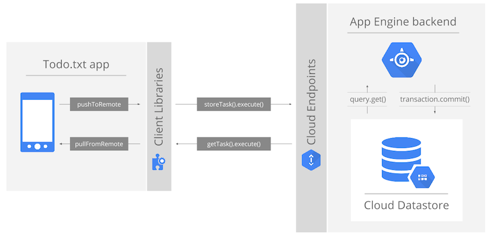

* First, make sure the backend is running: select the **todoTxtBackend**
module in the dropdown and run the server.
* Second, select the `todoTxtTouch` module and press run. If you don't have
the emulator running, this should bring up this dialog:

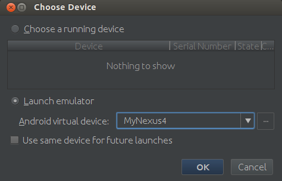

Click OK and wait for the emulator to start.

> If you don't have any virtual device defined, simply bring up the AVD manager
and create one with Android 4.4.2 API Level 19+ and SD Card present (200MB).

Once started, you can start using the application to add tasks, mark them as
completed, and delete them. Use the API Explorer available at
[http://localhost:8080/_ah/api/explorer](http://localhost:8080/_ah/api/explorer)
to invoke `getTasks()` with no parameters and make sure tasks are indeed
stored in your Datastore.

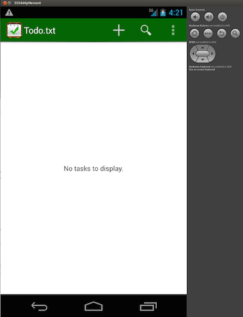 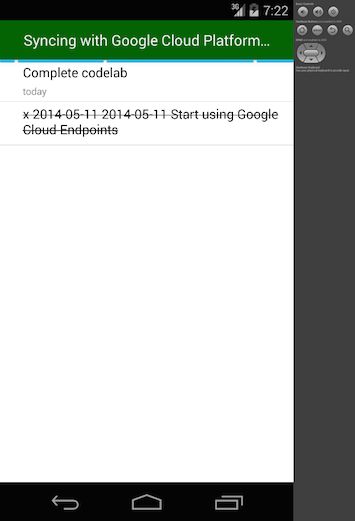

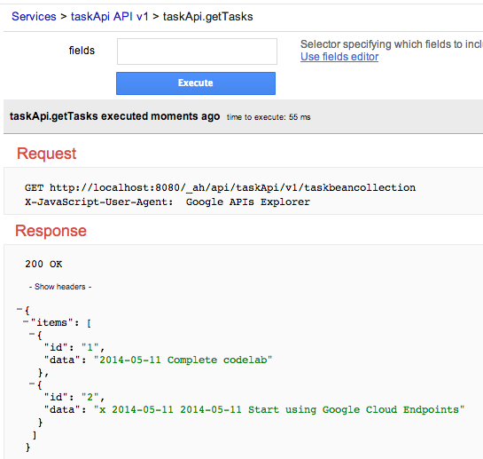

## Step 6 - Escape to the command line and deploy to production!

While we've been comfortably sitting in an IDE throughout the development of
both the client and the server sides of this codelab, everything was actually
handled by the [Gradle App Engine
Plugin](https://github.com/GoogleCloudPlatform/gradle-appengine-plugin) under
the covers and thus we can easily escape to a command-line or to another tool
(such as a continuous integration server).

But first, open `appengine-web.xml` and set the app id to the name you used
when creating the Google Cloud Platform project at the very beginning of this
codelab:

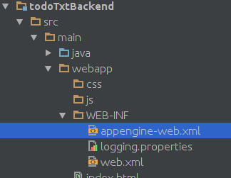

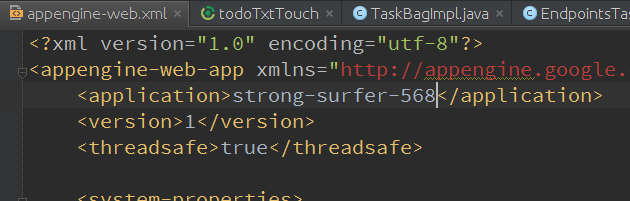

Navigate to the `build.gradle` file at the root of the `todoTxtBackend` module
and make sure the `appengine` section contains this authorization attribute
which will allow Gradle to propagate your Google Cloud OAuth2 credentials to
deploy the backend to Google App Engine:

```Groovy
appcfg {
  oauth2 = true
}
```

Now open a terminal window and set the directory to the root of the project
(select the top node and **Edit > Copy Path**).

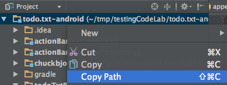

On the command line type the following command to (build if necessary and)
deploy the Endpoints backend application to Google App Engine:

`$ ./gradlew todoTxtBackend:appengineUpdate`

```
:todoTxtBackend:appengineDownloadSdk
:todoTxtBackend:compileJava UP-TO-DATE
...
:todoTxtBackend:appengineUpdate
Reading application configuration data...
...
INFO: Successfully processed todo.txt-android/todoTxtBackend/build/exploded-app/WEB-INF/appengine-web.xml
INFO: Successfully processed todo.txt-android/todoTxtBackend/build/exploded-app/WEB-INF/web.xml
Beginning interaction for module default...
0% Created staging directory at: '/var/folders/00/17tt8000h01000cxqpsvm004zb9/T/appcfg68248664257210145.tmp'
5% Scanning for jsp files.
20% Scanning files on local disk.
25% Initiating update.
28% Cloning 2 static files.
31% Cloning 13 application files.
52% Uploaded 1 files.
61% Uploaded 2 files.
68% Uploaded 3 files.
73% Uploaded 4 files.
77% Uploaded 5 files.
80% Uploaded 6 files.
82% Initializing precompilation...
84% Sending batch containing 6 file(s) totaling 16KB.
90% Deploying new version.
95% Will check again in 1 seconds.
98% Will check again in 2 seconds.
99% Will check again in 4 seconds.
99% Closing update: new version is ready to start serving.
99% Uploading index definitions.
Update for module default completed successfully.
Success.
Cleaning up temporary files for module default...
BUILD SUCCESSFUL
Total time: 24.6 secs
```

> * If you are not yet authenticated with your project, the deploy via gradle
will redirect you to a web page to set up authorization and generate a long
String. This string should be pasted in the shell window (even if there is no
explicit prompt). This [page](https://github.com/GoogleCloudPlatform/gradle-appengine-templates/tree/master/HelloEndpoints#22-deploying-the-backend-live-to-app-engine)
has more details if needed.
> * You could also use the Cloud SDK and its `gcloud auth login`
command to complete the same one-time authorization.

Once the backend is successfully deployed, you can go back to the
[Developers Console](https://console.developers.google.com) and check the
dashboard, current application version, logs, etc.

On the Android side you can now simplify the initialization of the
`taskAPIService` by removing the root URL and request initializer used for
testing against the local development app server. In
`EndpointsTaskBagImpl.java`, this is now how we create the `TaskAPI.Builder`
object:

```java
TaskApi.Builder builder =
    new TaskApi.Builder(AndroidHttp.newCompatibleTransport(), new AndroidJsonFactory(), null);
```

Rebuilding the Android application will pick up the changes made to the backend
(it's no longer local to you machine but rather lives in the
Cloud) so you don't need to explicitly re-install the Endpoints client
libraries.

Run the Android client one more time and add a new task.

The current synchronisation implementation will fetch tasks from local storage
so unless you explicitly ask for a sync in the application menu or add a new
task, the Datastore and the application will not be in sync.

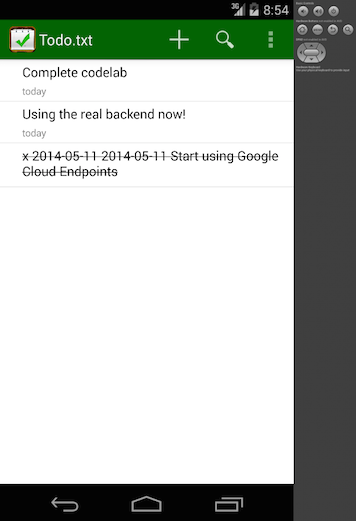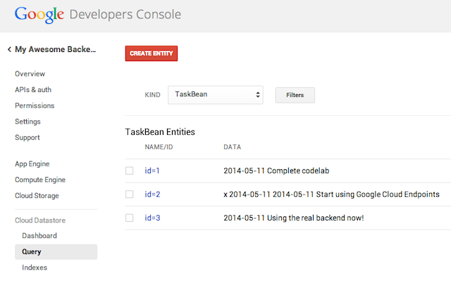

As you can see in the screenshot above a query of `TaskBean` entities in the
Cloud Datastore returns the list of tasks in our new Android Todo.txt
application!

## Step 6 - Improve the application!

Believe it or not, this application is not quite perfect!
Here are a few ideas to enhance the code and the user experience:

* Add **Endpoints authentication** by re-using the Android logged-in user
credentials and thus preventing anyone to access your Endpoints. Check out
this documentation:
[https://developers.google.com/appengine/docs/java/endpoints/auth](https://developers.google.com/appengine/docs/java/endpoints/auth)
* Use **memcache** to drastically improve performance of your application
under load. See this Memcache overview:
[https://developers.google.com/appengine/docs/java/memcache/](https://developers.google.com/appengine/docs/java/memcache/)
* Implement **better sync logic** with some level of incremental synchronisation.

You are also encouraged to use a real Android device, either through USB
debugging or by generating a signed APK (In Android Studio:
**Build > Generate Signed APK...**) and installing it on a phone or tablet.

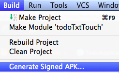

If you'd like to watch a 30-minute presentation of this entire codelab with
live coding of all the steps, simply look at
[this YouTube video](https://www.youtube.com/watch?v=7Sp4Lr3Qmcw)
(recorded in San Francisco in Mars 2014).

This concludes this codelab: Thanks for your time and we hope this was
valuable to you! Now go build something great! :)

## Appendix - Using the APIs Explorer

Check out this world's shortest introduction to the [API Explorer](docs/APIExplorer.md).

## Appendix - Looking around the App Engine Console

Curious about the console? Here's a super quick overview of the [App Engine Developer Console](docs/AppEngineConsole.md).
