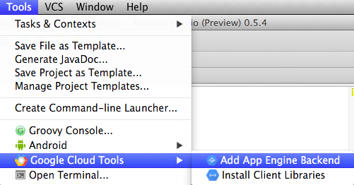
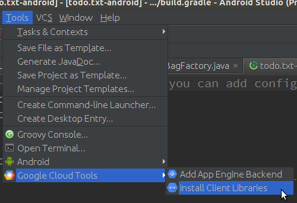
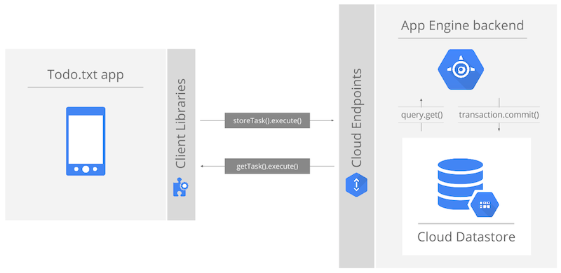
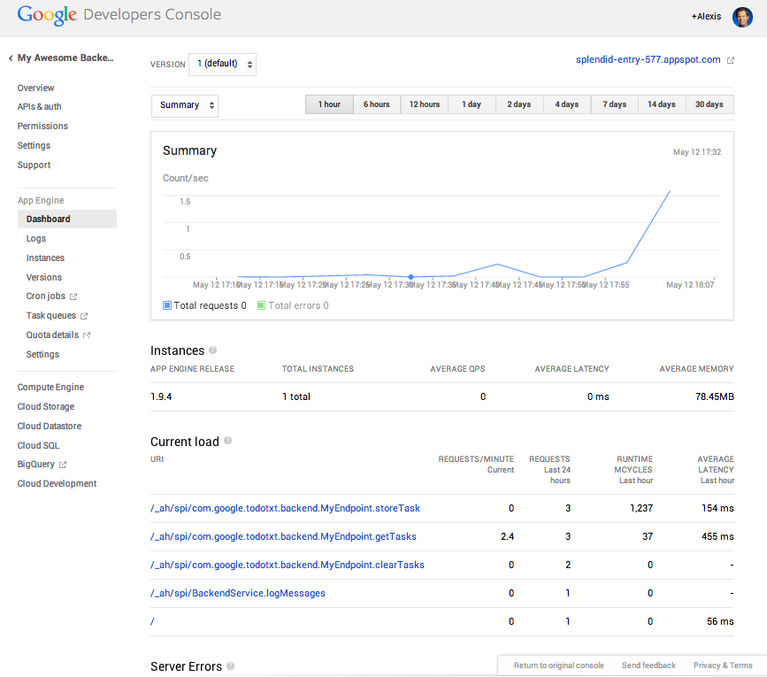

# Android Endpoints "Todo.txt" CodeLab

* * *


*May 2014*

This codelab is an introduction to Google Cloud Endpoints, the technology that enables the publication of RESTful APIs which can easily be consumed by Android applications. We will start from an existing mobile Android application and connect it to a brand new backend powered by Cloud Endpoints. All development will be done with the Android Studio IDE.

## Codelab Requirements

* A reasonably-powered laptop with plenty of RAM
    * please avoid ultrabooks! sorry, also no chromebooks ATM
* A Java Development Kit (**JDK, not JRE**), version 7 (Java 7)
* Latest **[Android Studio](http://developer.android.com/sdk/installing/studio.html#download)**
    * **The Android Emulator**
        * The AVD should be created with :
            * Android 4.4.2 API Level 19+
            * Hardware Keyboard Present
            * SD Card present, 200MiB

    * **Android SDK Manager** (accessible from Tools>Android) configured with :
        * Android SDK Tools
        * Android SDK Build-tools 19.0.2
        * Android SDK Platform-tools
        * Android Support Repository
        * Android 4.0.3 (API 15+) or above

## Introduction

### The Todo.txt application


Todo.txt is an Android application [available from the Play Store](https://play.google.com/store/apps/details?id=com.todotxt.todotxttouch) that stores tasks in the Cloud. It's simple to understand and use, has great user ratings and, best of all, is open sourced with full code available on github at [https://github.com/ginatrapani/todo.txt-android](https://github.com/ginatrapani/todo.txt-android).

In this code lab we will use a single development environment (Android Studio) to build a brand new Google Cloud Platform backend to store user tasks, thus replacing the existing Cloud provider.


All coding in this codelab, client and backend, will be done in Java within Google App Engine's free tier and using [Google Cloud Endpoints](https://developers.google.com/appengine/docs/java/endpoints/).

### Android Studio - the integrated tool


Throughout the codelab, we'll use Android Studio, an open-source IDE built for Android by Google, it is based on IntelliJ IDEA with coding assistance tools to help write Java code, it offers an integrated visual editor with a layout designer and a large number of bundled static code analysis tools (Lint) to help build quality apps. It's integrated with **Gradle** to enable one build across dev environment (IDE, command line, continuous integration server, etc).

Android Studio is still in preview (version 0.5.x) as of this writing but fully functional and tested for what we're trying to do in this lab. Note we'll also be using **Java 7** as the target Java SDK for both the Android application and the App Engine Endpoint backend.

This IDE will also allow you to : 

* Create Google App Engine backends right from Android Studio
* Generate Java-specific bindings for use in our Android application
* Benefit from as-you-type validations and quick-fixes when defining the backend API
* Use App Engine-specific Gradle tooling that allows for a unified client/backend build




### Google Cloud Endpoints - where the magic happens


[Google Cloud Endpoints](https://developers.google.com/appengine/docs/java/endpoints/) is the key technology used in this codelab. It offers an extremely simple way to build server-side logic on Google App Engine, leveraging this platform's auto-scaling and high-availability.

Cloud Endpoints exposes standards based REST interfaces with built-in authorization and auto-generates strongly typed, and mobile optimized client libraries for Android, iOS and web. This is a fully supported service provided by the Google Cloud Platform with integration in Android Studio (see previous section).

In Java, using `Api`, `@ApiMethod` and associated attributes enables you to decorate your business logic to expose it as RESTful APIs. Here's a simple example :

```java

@Api(name = "myApi", version = "v1")
public class MyEndpoint {

  @ApiMethod(name = "helloWorld")
  public String hello() {
    return "Hello World!";
  }

}

```

The following HTTP request will be mapped to a call to the above `hello()` method : 

`HTTP GET https://<project_id>.appspot.com/_ah/api/myApi/v1/helloWorld`

Luckily, as we will see, the Endpoints technology comes with the ability to generate Android clients to avoid having to deal with HTTP request construction and json response parsing.

### Overall codelab architecture

As you can see on this diagram, we'll be building an [App Engine](https://developers.google.com/appengine) application which will store the user tasks in Google's [Cloud Datastore](https://developers.google.com/datastore/) and communicate with the Android application via Endpoints. 


Using this new backend will require making small changes to the current Android application.

To make to calls to our RESTful endpoints, we can rely on generated client libraries which will help us make calls from the Android application as if they we local. No JSON parsing or HTTP-level coding required!

Let's get going!


## Step 0 - Create your own project in the Google Developers Console

Point your browser to the [developers console](https://console.developers.google.com/) and create a new project (login first if required) :

   

Use the suggested **Project ID** (it is unique and available) or create your own. You'll need this to deploy your backend after it's created using Android Studio so remember what you enter.

Once created, this Google Cloud Platform project will enable you to manage all the services the Cloud Platform has to offer. In this lab, we'll use App Engine and Cloud Datastore.

Every Google Cloud Platform project can create a free and private **git repository** which you're free to use in this lab but this is not a requirement. You can also connect your project to an existing GitHub repo. Both these options enable the [Push-to-Deploy](https://developers.google.com/appengine/docs/push-to-deploy) feature and are available from the console's "Cloud Development" menu.


In this codelab we'll start a new backend project from scratch.


## Step 1 - Get the Android application source code

The Android application source code is available in [this GitHub repository](https://github.com/GoogleCloudPlatform/endpoints-codelab-android) as a Gradle project (or alternatively from this [Zip archive](http://storage.googleapis.com/todo-codelab/TodoTxt.zip)). This is the slightly modified version of the [Todo.txt application code found on GitHub](https://github.com/ginatrapani/todo.txt-android), enough to start coding to add Google Cloud Platform as a backend.

Open Android Studio and import the code as a new project. Remember, this needs to use **Java 7**. Check the SDK Location in your **File** > **Project Structure**.


This should trigger a successful (Gradle) build :


> If the build fails, make sure you have the **Support Repository** installed (see last paragraph of [http://developer.android.com/sdk/installing/studio.html](http://developer.android.com/sdk/installing/studio.html) for details).

From here we'll create, build and test the backend before we make our way back to the Android client to hook it up to this new backend.


## Step 2 - Create the endpoints backend project

Android Studio has built-in support for Google Cloud Endpoints.

To add a backend to the current Android project, simply go to: **Tools > Google Cloud Tools > Add App Engine backend**


Make sure you select the "App Engine Java **Endpoints** Module" template and use the following values :

* Module Name: **todoTxtBackend**
* Package Name: **com.google.todotxt.backend**


This creates a new backend module for this Android Studio project and adds it as an additional dependency in the `settings.gradle` file.The generated code is pretty straight-forward with an object model for the data manipulated by the endpoint and the actual endpoint implementation :


```java

@Api(name = "myApi", version = "v1",
     namespace = @ApiNamespace(ownerDomain = "backend.todotxt.google.com",
                                 ownerName = "backend.todotxt.google.com",
                               packagePath = ""))
public class MyEndpoint {

        @ApiMethod(name = "sayHi")
        public MyBean sayHi(@Named("name") String name) {
        MyBean response = new MyBean();
        response.setData("Hi, " + name);
        return response;
    }

}
```

An HTTP POST request to `myApi/v1/sayHi/Test` will be routed to the `sayHi()` method and `"Test"` will be mapped to the `name` attribute.

The convention here is that sending data to the endpoint implies that the server state will change and thus only POST requests will be mapped to this method. You can be explicit about which HTTP verb is used (in particular to distinguishing between a PUT and a POST) by specifying the optional `httpMethod` attribute of `@ApiMethod` (`HttpMethod.POST` in this case).

All Cloud Endpoints annotations and attributes are documented here: [https://developers.google.com/appengine/docs/java/endpoints/annotations](https://developers.google.com/appengine/docs/java/endpoints/annotations) 

Parameter types and return values are documented here: [https://developers.google.com/appengine/docs/java/endpoints/paramreturn_types](https://developers.google.com/appengine/docs/java/endpoints/paramreturn_types)

Without making any changes for the time being, simply start the development app server (a full App Engine local environment) by pressing the green "Play" button after selecting **todoTxtBackend** as the current module :

  

> If you see a red cross on the module, this means that either :
> * you do not have a Java 7 setting for the project. You'll need to update this in :
> **File > Project Structure > SDK Location > JDK location**.
> * you have to build the module first to bring in all the dependencies (such as the App Engine SDK). Simply **Build > Make module 'todoTxtBackend'**.

Once the development app server has started you should see this log message  :

```
INFO: Module instance default is running at http://localhost:8080/
com.google.appengine.tools.development.AbstractModule startup
INFO: The admin console is running at http://localhost:8080/_ah/admin
com.google.appengine.tools.development.DevAppServerImpl doStart
INFO: Dev App Server is now running
```

You can then point your browser to [http://localhost:8080](http://localhost:8080) to exercise the sample endpoints functionality or more interestingly go to [http://localhost:8080/_ah/api/explorer](http://localhost:8080/_ah/api/explorer) to use the Google API Explorer tool which you may already be familiar with if you've used in the past any public Google API. See the "Using the APIs Explorer" Appendix at the end of this document for further details.

Once done testing the default endpoint, stop the local development app server (red square in the log window or **Run > Stop**).

At this point we have the basic Endpoints infrastructure in place but we still need to store tasks in a Datastore and wire up the Android application to use this new backend.


## Step 3 - Implement reading and writing tasks to the Datastore

Let's start with some small refactoring :

1. Rename the `MyBean` class to `TaskBean` (**Refactor > Rename**) 
2. Add a `Long id` attribute to the `TaskBean` class along with getter and setter (**Code > Generate > Getter and Setter**)


This is the modified **TaskBean** class :

```java

public class TaskBean {
    Long id;
    public Long getId() { return id; }
    public void setId(Long id) { this.id = id; }

    private String myData;
    public String getData() { return myData; }
    public void setData(String data) { myData = data; }
}
```

In `MyEndpoint.java`, change the name of the endpoint from `"myApi"` to `"TaskApi"`. Notice how a tooltip indicates that this is not a recommended name (names should not be capitalized). Consequently, change it to `"taskApi"` :


This suggestion is one of a set of Endpoints-related inspections in Android Studio which you can find in the project properties :


Remove the default `sayHi()` method and add these three methods and associated annotations (you can either copy/paste from this document or use the `MyEndpoint.java` file located in the [`snippets/` directory TODO]() of the archive for this codelab) :

The following `storeTask` method will be invoked when the following HTTP request is received: `POST https://<project_id>.appspot.com/_ah/api/taskApi/v1/storeTask`

Note how the `@Api` and `@ApiMethod` attributes are used to build this URI. The mapping from a POST request is implicit again here because we're passing the method a parameter (of type `TaskBean`). This parameter is exchanged on the wire in json format (as a simple pair of `data` and `id` attribute values) and marshalled in and out of Java directly by Cloud Endpoints.

```java

@ApiMethod(name = "storeTask")
public void storeTask(TaskBean taskBean) {
    DatastoreService datastoreService = DatastoreServiceFactory.getDatastoreService();
    Transaction txn = datastoreService.beginTransaction();
    try {
        Key taskBeanParentKey = KeyFactory.createKey("TaskBeanParent", "todo.txt");
        Entity taskEntity = new Entity("TaskBean", taskBean.getId(), taskBeanParentKey);
        taskEntity.setProperty("data", taskBean.getData());
        datastoreService.put(taskEntity);
        txn.commit();
    } finally {
        if (txn.isActive()) {
            txn.rollback();
        }
    }
}
```

This next `getTasks()` method is invoked when this HTTP request is received :

`GET https://<project_id>.appspot.com/_ah/api/taskApi/v1/taskbeancollection`

This time we're responding to a GET operation because the method takes no parameter and starts with `get` and thus it should be safe to assume that all such request will be idempotent (i.e. it will not change the server state).

```java

@ApiMethod(name = "getTasks")
public List<TaskBean> getTasks() {
    DatastoreService datastoreService = DatastoreServiceFactory.getDatastoreService();
    Key taskBeanParentKey = KeyFactory.createKey("TaskBeanParent", "todo.txt");
    Query query = new Query(taskBeanParentKey);
    List<Entity> results = datastoreService.prepare(query).asList(FetchOptions.Builder.withDefaults());
    ArrayList<TaskBean> taskBeans = new ArrayList<TaskBean>();
    for (Entity result : results) {
        TaskBean taskBean = new TaskBean();
        taskBean.setId(result.getKey().getId());
        taskBean.setData((String) result.getProperty("data"));
        taskBeans.add(taskBean);
    }

    return taskBeans;
}
```

This third and final `clearTasks()` method is called on this HTTP request :

`POST https://<project_id>.appspot.com/_ah/api/taskApi/v1/clearTasks`

```java

@ApiMethod(name = "clearTasks")
public void clearTasks() {
    DatastoreService datastoreService = DatastoreServiceFactory.getDatastoreService();
    Transaction txn = datastoreService.beginTransaction();
    try {
        Key taskBeanParentKey = KeyFactory.createKey("TaskBeanParent", "todo.txt");
        Query query = new Query(taskBeanParentKey);
        List<Entity> results = datastoreService.prepare(query).asList(FetchOptions.Builder.withDefaults());
        for (Entity result : results) {
            datastoreService.delete(result.getKey());
        }
        txn.commit();
    } finally {
        if (txn.isActive()) { txn.rollback(); }
    }
}
```

This method clearly does modify the server state and thus its name does not start with `get`. An HTTP POST is required to call this method. Another common RESTful request is the use of HTTP PUT but in our case we're never modifying existing data.

If needed, here are the appropriate import statements for the entire endpoints class :

```java

import com.google.api.server.spi.config.Api;
import com.google.api.server.spi.config.ApiMethod;
import com.google.api.server.spi.config.ApiNamespace;
import com.google.appengine.api.datastore.DatastoreService;
import com.google.appengine.api.datastore.DatastoreServiceFactory;
import com.google.appengine.api.datastore.Entity;
import com.google.appengine.api.datastore.FetchOptions;
import com.google.appengine.api.datastore.Key;
import com.google.appengine.api.datastore.KeyFactory;
import com.google.appengine.api.datastore.Query;
import com.google.appengine.api.datastore.Transaction;
import java.util.ArrayList;
import java.util.List;
```

These three methods all manipulate instances of `TaskBean` to store, read and delete tasks from the Datastore. Getting a hold of the Datastore is as easy as calling a factory method. `TaskBean` instances need to be turned into Entity instances with a hard-coded `"todo.txt"` key and appropriate attributes before they can be read from or wrote into the Cloud Datastore. Writing and deleting happens within the boundaries of a transaction.

At this point we have a fully functional backend exposing three methods to store, read and delete tasks in the highly-scalable Cloud Datastore, all through the Cloud Endpoints technology.


## Step 4 - Install Java Client Libraries, add dependency to Android project

While exposing standard RESTful interfaces makes it possible to access them from an Android application, the Cloud Endpoints technology is able to create client libraries (in our case a Java library) to enable a much easier implementation on the client-side with high-level abstractions such as Java classes rather than the underlying JSON and HTTP concepts. To generate the client library for our task endpoints, simply use the following menu : **Tools > Google Cloud Tools > Install Client Libraries**.



This will scan the project for Cloud Endpoints artifacts (our `MyEndpoint` class here), generate the appropriate client library and install it into the local maven repository, thus making them accessible to the client Android application.



If you are curious, the generated code is placed in the project's `build/client-libs/taskApi-v1-java.zip` and contains the following files (the names are derived from the endpoint name) : 

```
taskApi/TaskApiScopes.java
taskApi/model/TaskBean.java
taskApi/model/TaskBeanCollection.java
taskApi/TaskApi.java
taskApi/TaskApiRequest.java
taskApi/TaskApiRequestInitializer.java
```

We'll see in the next step how to use these classes from within the Android application.

Next, we need to update the `todoTxtTouch` module's `build.gradle` file to add two dependencies - the generated `taskApi` library and the HTTP Client Android support library. Add these two dependencies at the top of the `dependencies` section of the file (make sure you do this on the module-level build file, not on the project top-level `build.gradle` configuration file) :

```groovy

compile('com.google.todotxt.backend:taskApi:v1-1.18.0-rc-SNAPSHOT') {
    exclude(group: 'org.apache.httpcomponents', module: 'httpclient')
}

compile('com.google.http-client:google-http-client-android:1.18.0-rc') {
    exclude(group: 'com.google.android', module: 'android')
    exclude(group: 'org.apache.httpcomponents', module: 'httpclient')
}
```

If required, the complete `build.gradle` file for `todoTxtTouch` is located in the [`snippets/` directory TODO]() of the codelab archive. Once you've made this change, you'll be prompted to perform a **"gradle sync"** :


At this point the Android client application is ready to start using the Endpoints client library to store tasks in our Google Cloud backend. Further documentation on how to consume the Cloud Endpoints in Android is here: [https://developers.google.com/appengine/docs/java/endpoints/consume_android](https://developers.google.com/appengine/docs/java/endpoints/consume_android).

## Step 5 - Modify the android application to use the new backend. Run. Test.

Navigate to the `com/todotxt/todotxttouch/task/TaskBagImpl.java` file in the `todoTxtTouch` module (it may be one of the tabs already open) and navigate to line 215 (using **Navigate > Line** should get you to `/* REMOTE APIS */`).

This is the interesting part: the `pushToRemote` and `pullToRemote` methods implement the actual communication with the backend which we want to set to use the Google Cloud Platform. Rather than making changes to this existing class we'll create a new subclass of `TaskBagImpl` called `EndpointsTaskBagImpl` (full source [here_TODO]()) :


```java

package com.todotxt.todotxttouch.task;

public class EndpointsTaskBagImpl extends TaskBagImpl {
    final TaskApi taskApiService;

    // Constructor
    public EndpointsTaskBagImpl (TodoPreferences preferences, LocalTaskRepository localRepository) {
        super(preferences, localRepository, null);
        TaskApi.Builder builder = new TaskApi.Builder(AndroidHttp.newCompatibleTransport(), 
            new AndroidJsonFactory(), null)
                .setRootUrl("http://10.0.2.2:8080/_ah/api/")
                .setGoogleClientRequestInitializer( new GoogleClientRequestInitializer() {
                    @Override
                    public void initialize(AbstractGoogleClientRequest<?> abstractGoogleClientRequest) throws IOException {
                        abstractGoogleClientRequest.setDisableGZipContent(true);
                    }
                }

            );
        taskApiService = builder.build();
    } // end of constructor, other methods to follow in this class...
```

This constructor above sets up a development environment by initializing the `TaskApi` instance to enable testing with the local development app server and the local Android emulator. As we'll see later, the initialization for the production code is somewhat simpler.

> If you were to run it on a real device, here are the required changes :
>
> 1. edit the `todoTxtBackend` run configuration to listen on 0.0.0.0 (default is 127.0.0.1)
>
> 2. replace 10.0.2.2 with LAN ip address of the laptop

The other two methods for the class are the new overridden `pushToRemote` and `pullFromRemote` methods.

These methods use the `taskApiService` and instances of `TaskBean` which are synchronized with the local application task repository. Here is the first method pushing local tasks to our Google Cloud backend via a simple call to `taskApiService.storeTask(taskBean).execute()`.

```java

@Override
public synchronized void pushToRemote (boolean overridePreference, boolean overwrite) {
    try {
        ArrayList<String> taskStrList = TaskIo.loadTasksStrFromFile(LocalFileTaskRepository.TODO_TXT_FILE);
        taskApiService.clearTasks().execute();

        long id = 1;
        for (String taskStr : taskStrList) {
            TaskBean taskBean = new TaskBean();
            taskBean.setData(taskStr);
            taskBean.setId(id++);
            taskApiService.storeTask(taskBean).execute();
        }

        lastSync = new Date();

        } catch (IOException e) {
            Log.e(EndpointsTaskBagImpl.class.getSimpleName(), 
            "Error when storing tasks", e);
    }
}
```

Finally, the second method reads all the tasks stored in our Google Cloud backend via a call to `taskApiService.getTasks().execute().getItems()` and writes them to local storage.

```java

@Override
public synchronized void pullFromRemote(boolean overridePreference) {

   try {
      // Remote Call
      List<TaskBean> remoteTasks = taskApiService.getTasks().execute().getItems();

      if (remoteTasks != null) {
          ArrayList<Task> taskList = new ArrayList<Task>();
          for (TaskBean taskBean : remoteTasks) {
              taskList.add(new Task(taskBean.getId(), taskBean.getData()));
          }
          store(taskList);
          reload();
          lastSync = new Date();
       }
    } catch (IOException e) {
        Log.e(EndpointsTaskBagImpl.class.getSimpleName(), "Error when loading tasks", e);
    }
}
```

Here is the full list of import statements for `EndpointsTaskBagImpl` :

```java

import android.util.Log;
import com.google.api.client.extensions.android.http.AndroidHttp;
import com.google.api.client.extensions.android.json.AndroidJsonFactory;
import com.google.api.client.googleapis.services.AbstractGoogleClientRequest;
import com.google.api.client.googleapis.services.GoogleClientRequestInitializer;
import com.google.todotxt.backend.taskApi.TaskApi;
import com.google.todotxt.backend.taskApi.model.TaskBean;
import com.todotxt.todotxttouch.TodoPreferences;
import com.todotxt.todotxttouch.util.TaskIo;
```

Note that the entire code for `EndpointsTaskBagImpl.java` is located in the [`snippets/` directory TODO]() of the codelab archive.

The very last step is to switch the Android client to use this subclass implementation. This is done in the `TaskBagFactory` class. Simply replace :

`return new TaskBagImpl(sharedPreferences, localFileTaskRepository, null);`

with :

`return new EndpointsTaskBagImpl(sharedPreferences,localFileTaskRepository);`

We can now run the entire architecture locally !


First, make sure the backend is running : select the **todoTxtBackend** module in the dropdown and run the server.

Second, select the `todoTxtTouch` module and press run. If you don't have the emulator running, this should bring up this dialog :


Click OK and wait for the emulator to start.

> If you don't have any virtual device defined, simply bring up the AVD manager and create one with Android 4.4.2 API Level 19+.

Once started, you can start using the application to add tasks, mark them as completed, and delete them. Use the API Explorer (available at [http://localhost:8080/_ah/api/explorer](http://localhost:8080/_ah/api/explorer)) to invoke `getTasks()` with no parameters and make sure the tasks are indeed store in your Datastore.

 


## Step 5. Escape to the command line and deploy to production!

While we've been comfortably sitting in an IDE throughout the development of both the client and the server sides of this codelab, everything was actually handled by the Gradle build tool under the covers and thus we can easily escape to a command-line or to another tool (such as a continuous integration server).

First, open `appengine-web.xml` and set the app id to the name you used when creating the Google Cloud Platform project at the very beginning of this codelab :


Navigate to the `build.gradle` file at the root of the `todoTxtBackend` module and make sure the `appengine` section contains this authorisation attribute which will allow Gradle to propagate your Google Cloud OAuth2 credentials to deploy the backend to Google App Engine.

```Groovy

appcfg {
  oauth2 = true
}
```

Now open a terminal window and set the directory to the root of the project (select the top node and **Edit > Copy Path**).


On the command line type the following command to (build if necessary and) deploy the endpoints application to Google App Engine:

```
$ ./gradlew todoTxtBackend:appengineUpdate
:todoTxtBackend:appengineDownloadSdk
:todoTxtBackend:compileJava UP-TO-DATE
...
:todoTxtBackend:appengineUpdate
Reading application configuration data...
...
INFO: Successfully processed todo.txt-android/todoTxtBackend/build/exploded-app/WEB-INF/appengine-web.xml
INFO: Successfully processed todo.txt-android/todoTxtBackend/build/exploded-app/WEB-INF/web.xml
Beginning interaction for module default...
0% Created staging directory at: '/var/folders/00/17tt8000h01000cxqpsvm004zb9/T/appcfg68248664257210145.tmp'
5% Scanning for jsp files.
20% Scanning files on local disk.
25% Initiating update.
28% Cloning 2 static files.
31% Cloning 13 application files.
52% Uploaded 1 files.
61% Uploaded 2 files.
68% Uploaded 3 files.
73% Uploaded 4 files.
77% Uploaded 5 files.
80% Uploaded 6 files.
82% Initializing precompilation...
84% Sending batch containing 6 file(s) totaling 16KB.
90% Deploying new version.
95% Will check again in 1 seconds.
98% Will check again in 2 seconds.
99% Will check again in 4 seconds.
99% Closing update: new version is ready to start serving.
99% Uploading index definitions.
Update for module default completed successfully.
Success.
Cleaning up temporary files for module default...
BUILD SUCCESSFUL
Total time: 24.6 secs
```

Once the backend is successfully deployed, you can go back to the [Developers Console](https://console.developers.google.com) and check the dashboard, current application version, logs, etc.



On the Android side you want to simplify the initialization of the `taskAPIService` by removing the root URL and request initializer used for testing against the local development app server. In `EndpointsTaskBagImpl.java`, this is how we create the `TaskAPI.Builder` object :

```java

TaskApi.Builder builder =
    new TaskApi.Builder(AndroidHttp.*newCompatibleTransport*(),
        new AndroidJsonFactory(), null);

```

We are also required to *install the Endpoints client libraries one more time* to pick up the new base URL which is derived from the application name we set earlier in `appengine-web.xml`. For that, simply select **Tools > Google Cloud Tools > Install Client Libraries** once again to update the android application.

Run the Android client one more time and add a new task. 

The current synchronisation implementation will fetch tasks from local storage so unless you explicitly ask for a sync in the application menu or add a new task, the Datastore and the application will not be in sync.


As you can see in the screenshot above a query of `TaskBean` entities in the Cloud Datastore returns the list of tasks in our new Android Todo.txt application!

## Step 6. Improve the application!

Believe it or not, this application is not quite perfect!
Here are a few ideas to enhance the code and the user experience : 

* Add **endpoints authentication** by re-using the Android logged-in user credentials and thus preventing anyone to access your endpoints. Check out this documentation : [https://developers.google.com/appengine/docs/java/endpoints/auth](https://developers.google.com/appengine/docs/java/endpoints/auth) 
* Use **memcache** to drastically improve performance of your application under load. See this Memcache overview: [https://developers.google.com/appengine/docs/java/memcache/](https://developers.google.com/appengine/docs/java/memcache/) 
* Implement **better sync logic** with some level of incremental synchronisation.

You are also encouraged to use a real Android device, either through USB debugging or by generating a signed APK (In Android Studio : **Build > Generate Signed APK...**) and installing it on a phone or tablet.


This concludes this codelab.

Thanks for your time. We hope this was valuable to you!

## Appendix - Using the APIs Explorer

As seen in greater (coding) details in this lab, the communication between the Android client and the AppEngine backend is powered by [Google Cloud Endpoints](https://developers.google.com/appengine/docs/java/endpoints/). Beyond offering an easy way for the developer to expose server-side business logic as RESTful endpoints, this technology offers the ability to use the Google APIs Explorer, that same tool used to explore any of the Google APIs (Maps, Calendar, Storage, Drive, etc.), only this time for any of your APIs.

To explore the APIs exposed by your backend, simply point your browser to `http://<project_id>.appspot.com/_ah/api/explorer`


Here's the API Explorer documentation page: [https://developers.google.com/explorer-help/](https://developers.google.com/explorer-help/)

## Appendix - Looking around the App Engine Console

The [admin console for App Engine](http://appengine.google.com) is a fully-featured dashboard offering all sorts of useful real-time information about the runtime and how your application is behaving. Here are some of the most important sections of this console.

### Dashboard

Charts give you real-time information about the load on your application (requests, memory, ...), the number of instances serving it, the App Engine version number, an overview of your quotas and the URLs that are the most commonly hit.


### Logs

Application and server logs are available for all instances for all versions of your application in a consolidated fashion. They are searchable, can be filtered by severity, date or a regular expression and are presented in the timezone of your choice (remember, chances are your application runs on multiple datacenters possibly in different time zones).

### Versions

App Engine supports running multiple versions of your application at the same time. Version names are free-form (alphanumeric characters) and are specified in your application metadata (`appengine-web.xml` for Java apps). In our case you should see only one version which obviously is also the default version.

Any version can be reached by pre-pending the version number to the URL, e.g. `http://<version>.<project_id>.appspot.com`.

An advanced but very useful feature of App Engine is *Traffic Splitting*. It allows to split the traffic across several versions of your app for A/B testing or rolling upgrades and is trivial to set up.

### Settings

This is where you can see (and change some of) the global settings for your project.

You can tune the performance of your application by using more powerful frontends, configuring idle instances (optional), or pending latency (also optional). That's it, that's all you can tune and it's a feature not a bug! App Engine's autoscaling does all of the heavy lifting for you so you can focus on your application.

Finally you can configure serving the application from a custom domain, disable writes to the datastore, migrate the application to a different identifier or mark the application for deletion.

### Permissions

Chances are you are not alone developing the project and this section lets you invite other participants with three role levels: Owner, Developer, and Viewer.

The Google App Engine console is further documented here: [https://developers.google.com/appengine/docs/adminconsole/index](https://developers.google.com/appengine/docs/adminconsole/index)
