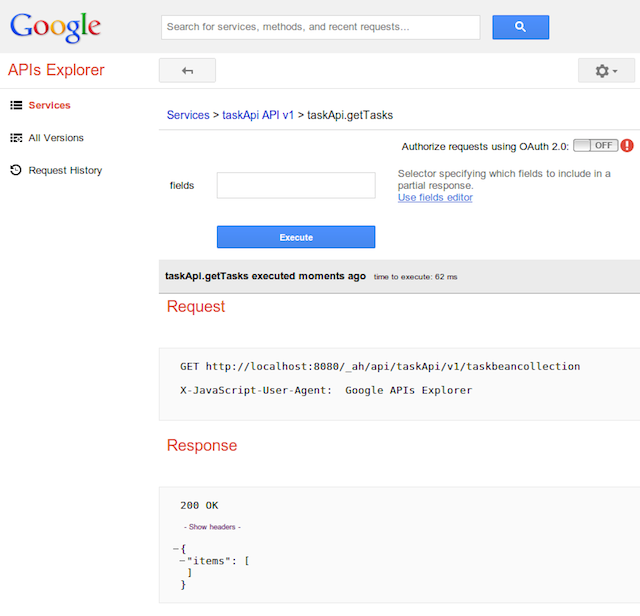

# Appendix - Using the APIs Explorer

As seen in greater (coding) details in this lab, the communication between
the Android client and the AppEngine backend is powered by
[Google Cloud Endpoints](https://developers.google.com/appengine/docs/java/endpoints/).
Beyond offering an easy way for the developer to expose server-side business
logic as RESTful endpoints, this technology offers the ability to use the
Google APIs Explorer, that same tool used to explore any of the Google APIs
(Maps, Calendar, Storage, Drive, etc.), only this time for any of your APIs.

To explore the APIs exposed by your backend, simply point your browser to
`http://<project_id>.appspot.com/_ah/api/explorer`

Here's the API Explorer documentation page:
[https://developers.google.com/explorer-help/](https://developers.google.com/explorer-help/)
