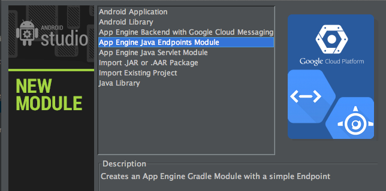

# Android Studio - the integrated tool

Throughout the codelab, we'll use Android Studio, an open-source IDE built for
Android by Google, it is based on IntelliJ IDEA. The IDE comes with coding
assistance tools to help write Java code, and offers an integrated visual editor
with a layout designer and a large number of bundled static code analysis tools
(Lint) to help build quality apps. Finally it's also integrated with **Gradle**
to enable one build across dev environment (IDE, command line, continuous
integration server, etc).

Android Studio is still not a finally releases product (Beta, version 0.8.x) as
of this writing but it is fully functional and tested for what we're trying to
do in this lab. Note we'll also be using **Java 7** as the target Java SDK for
both the Android application and the App Engine Endpoint backend.

This IDE will also allow you to :

* Create Google App Engine backends right from Android Studio
* Generate Java-specific bindings for use in our Android application
* Benefit from as-you-type validations and quick-fixes when defining the
backend API
* Use App Engine-specific Gradle tooling that allows for a unified
client/backend build

> If you're a fan or dark themes, you may be interested to know that some of the
Android Studio screenshots in this codelab have been generated with the
built-in "Darcula" theme :
Preferences > IDE Settings > Appearance > Theme > Darcula
