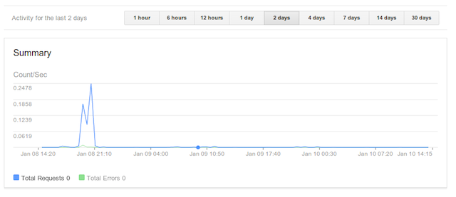

# Appendix - Looking around the App Engine Console

Curious about the App Engine console? Here's a super quick overview of

The [admin console for App Engine](http://appengine.google.com) is a
fully-featured dashboard offering all sorts of useful real-time information
about the runtime and how your application is behaving. Here are some of the
most important sections of this console.

## Dashboard

Charts give you real-time information about the load on your application
(requests, memory, ...), the number of instances serving it, the App Engine
version number, an overview of your quotas and the URLs that are the most
commonly hit.

## Logs

Application and server logs are available for all instances for all versions
of your application in a consolidated fashion. They are searchable, can be
filtered by severity, date or a regular expression and are presented in the
timezone of your choice (remember, chances are your application runs on
  multiple datacenters which can possibly be in different time zones).

## Versions

App Engine supports running multiple versions of your application at the same
time. Version names are free-form (alphanumeric characters) and are specified
in your application metadata (`appengine-web.xml` for Java apps). In our case
you should see only one version which obviously is also the default version.

Any version can be reached by pre-pending the version number to the URL, e.g.
`http://<version>.<project_id>.appspot.com`.

An advanced but very useful feature of App Engine is *Traffic Splitting*. It
allows to split the traffic across several versions of your app for A/B
testing or rolling upgrades and is trivial to set up.

## Settings

This is where you can see (and change some of) the global settings for your
project and configure the use of custom domains.

You can tune the performance of your application by using more powerful
frontends, configuring idle instances (optional), or pending latency (also
  optional). That's it, that's all you can tune and it's a feature not a bug!
  App Engine's autoscaling does all of the heavy lifting for you so you can
  focus on your application.

Finally you can configure serving the application from a custom domain,
disable writes to the datastore, migrate the application to a different
identifier or mark the application for deletion.

## Permissions

Chances are you are not alone developing the project. Inviting other
participants to the project can be achieved in this section and is applicable
to the overall Cloud Platform project. You can grant participants ownership,
project edit or simply view permissions.

The Google App Engine console is further documented here:
[https://developers.google.com/appengine/docs/adminconsole/index](https://developers.google.com/appengine/docs/adminconsole/index)
