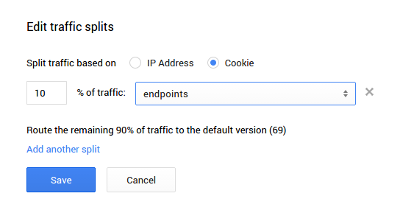
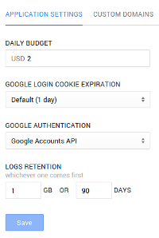

# Appendix - Looking around the App Engine Developers Console

Curious about the App Engine console? Here's a super quick overview.

All the App Engine services can be accessed through the App Engine section of
any [Google Developers Console](http://console.developers.google.com) project.
The various dashboards offer useful real-time information about the runtime and
about how your application is behaving. Here are some of the most important
sections of this console.

## Dashboard

For a given project in the Developers Console, simply navigate to
``Compute > App Engine > Dashboard``. The charts there give you real-time
information about the load on your application (requests, memory, ...), the
number of instances serving it, the App Engine version number, an overview of
your quotas, any client or server errors as well as the URLs that are the most
commonly hit.

## Versions

App Engine supports running multiple versions of your application at the same
time. Version names are free-form (alphanumeric characters) and are specified
in your application metadata (`appengine-web.xml` for Java apps). In our case
you should see only one version which obviously is also the default version.

Any version can be reached by pre-pending the version number to the URL, e.g.
`http://<version>.<project_id>.appspot.com`.

An advanced but very useful feature of App Engine is *Traffic Splitting*. It
allows to split the traffic across several versions of your app for A/B
testing or rolling upgrades and is trivial to set up.

## Settings

This is where you can see (and change some of) the global settings for your
project such as daily budget and configure the use of custom domains.

You might find this section to be somewhat empty, but App Engine's autoscaling
does all of the heavy lifting for you so you can focus on your application.

## Permissions

Chances are you are not alone developing the project. Inviting other
participants to the project can be achieved by navigating to the Developer
Console project ``Permissions`` section.
You can grant participants ownership, project edit or simply view permissions.

## Logs

The application and server logs are available for all instances for all
versions of your application in a consolidated fashion and can be found in the ``Monitoring > Logs`` section of your Developers Console project. They are
searchable, can be filtered by severity, date or a regular expression and are
presented in the timezone of your choice (remember, chances are your application
  runs on multiple datacenters which can possibly be in different time zones).

---

The Google Developer Console is further documented here:
[https://developers.google.com/console/help/new/](https://developers.google.com/console/help/new/)
