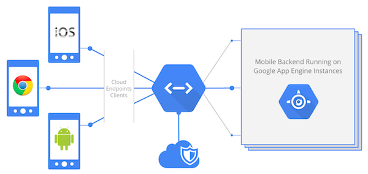

# Google Cloud Endpoints - where the magic happens



[Google Cloud Endpoints](https://developers.google.com/appengine/docs/java/endpoints/)
is the key technology used in this codelab. It offers an extremely simple way
to build server-side logic on Google App Engine, leveraging this platform's
auto-scaling and high-availability.

Cloud Endpoints exposes standards based REST interfaces with built-in
authorization and auto-generates strongly typed, and mobile optimized client
libraries for Android, iOS and JavaScript. This is a fully supported service
provided by the Google Cloud Platform with integration in Android Studio (see
previous section).

In Java, using `@Api`, `@ApiMethod` and associated attributes enables you to
decorate your business logic to expose it as RESTful APIs.

Here's a simple example :

```java

@Api(name = "myApi", version = "v1")
public class MyEndpoint {

    @ApiMethod(name = "helloWorld")
    public String hello() {
        return "Hello World!";
    }

}
```

The following HTTP request will be mapped to a call to the above `hello()`
method :

`HTTP GET https://<project_id>.appspot.com/_ah/api/myApi/v1/helloWorld`

Luckily, as we will see, the Endpoints technology comes with the ability to
generate Android clients to avoid having to deal with HTTP request construction
and json response parsing.

> You'll find plenty of documentation for Google Cloud Endpoints here :
https://developers.google.com/appengine/docs/java/endpoints/
